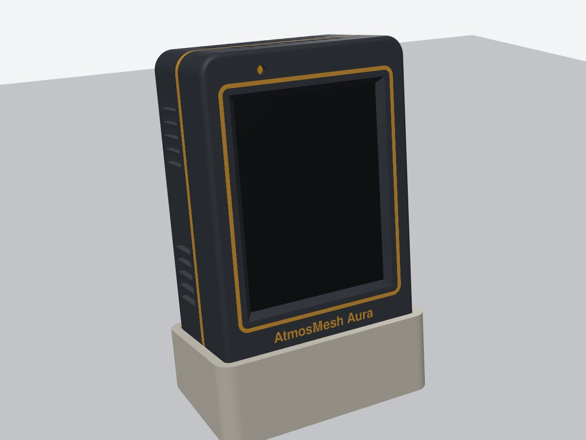
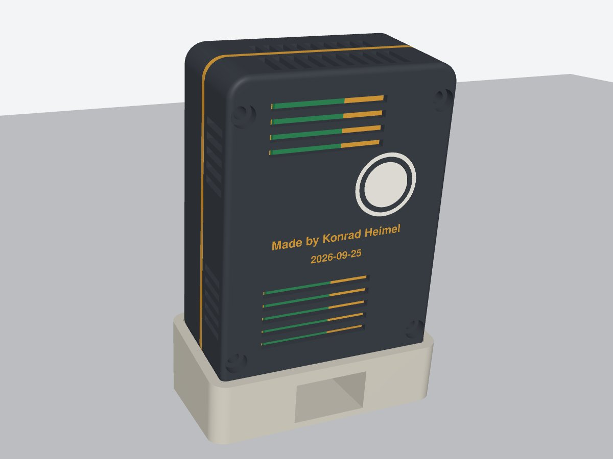
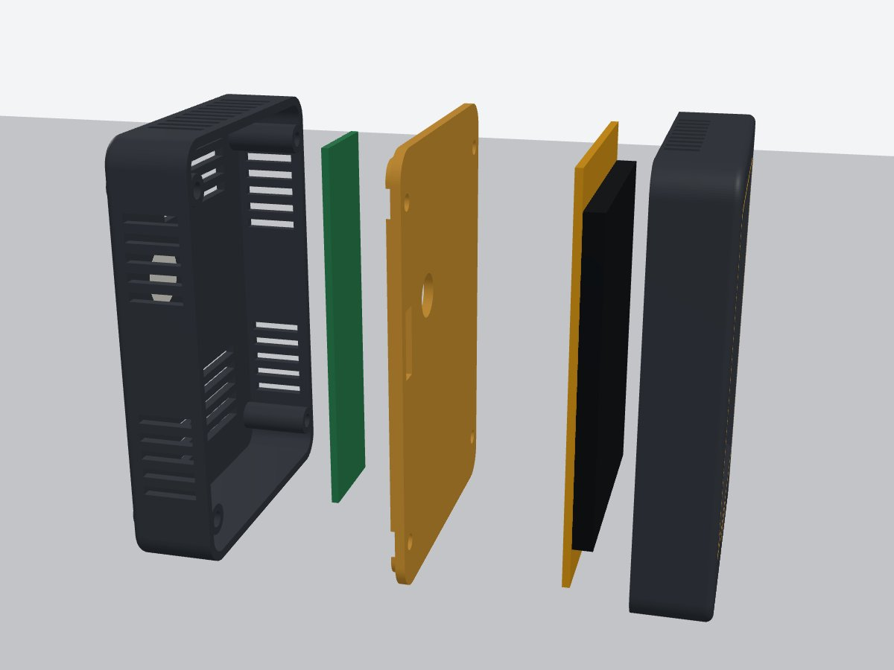
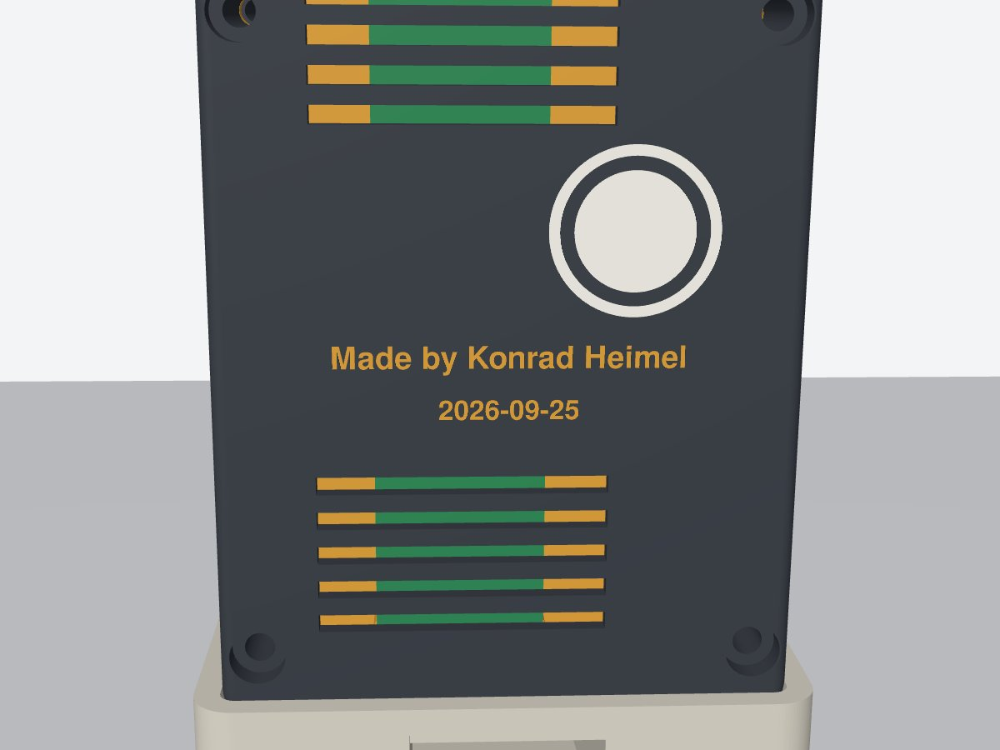

# AtmosMesh Aura: CYD desk enclosure (v1, unverified fit)

A parametric enclosure for the ESP32-2432S028 "Cheap Yellow Display" (USB-C variant). It stands
upright in portrait on a removable cradle and has a separate sensor bay behind the display for a
2 × 8 cm perfboard.

| Front | Back | Exploded |
| --- | --- | --- |
|  |  |  |

Outer case: **64.3 × 90.3 × 35.6 mm** (W × H × D). With the cradle it is about 110 mm tall and
leans back 8°.

## Why it has a divider

A sensor pressed against the back of a CYD reads 2–5 °C high, which is the self-heating objection in
the Aura design (§4.1). The case therefore has **two chambers with separate airflow**:

- **CYD chamber (front).** Air enters through the cradle's back arch and the bottom slots, and
  leaves through the top slots.
- **Sensor bay (back).** Air enters through the low side and back slots, and leaves through the
  high side, back and top slots.

The **baffle** between the two chambers blocks radiant heat from the board. Mount the BME280 at the
**bottom** of the perfboard, where room air comes in, and the ENS160 (with its heater) at the
**top**, so that the ENS160's warm air rises away from the BME280.

## Parts

| File (in `out/`) | Print orientation | Notes |
| --- | --- | --- |
| `aura_front.3mf` | Front face on the bed (already oriented) | 3 parts: body, accent ring, "AtmosMesh Aura" wordmark. The inlays are 0.6 mm deep, so colour changes only happen in the first 3 layers |
| `aura_baffle.3mf` | Flat, standoffs up | Its 2 mm edge shows as an accent stripe at the seam, so print it in the accent colour |
| `aura_rear.3mf` | Back face on the bed | 3 parts: body, the translucent "halo" window over the CYD's RGB LED, and the "Made by Konrad Heimel / 2026-09-25" inlay (accent colour, first 3 layers) |
| `aura_cradle.3mf` | Ground face down | Plain single colour. U-shaped, so no supports are needed |

`*.step` files are the same parts in assembled position (plus board stand-ins, for checking the fit
in any CAD tool). `*.stl` files are the individual bodies, in print orientation.

**Bambu Studio (P2S + AMS).** Open each 3MF. It loads as one object with several parts. In the
Objects list, give each part a filament. Suggested scheme: body in matte charcoal, ring, wordmark
and baffle in amber/gold, halo in translucent or natural PETG/PLA, cradle in warm grey or wood PLA.
The lettering is 3–4 mm tall, which a standard 0.4 mm nozzle handles. Print the first layer slowly so it stays crisp.
Settings: 0.2 mm layers, 3 walls, 15 % gyroid infill, no supports. A textured PEI plate gives the
front face a nice finish.

## Hardware

| Qty | Part | Use |
| --- | --- | --- |
| 4 | M3 × 6 screw (thread-forming, or machine screw into the 2.6 mm pilot) | CYD into the front bosses |
| 4 | M3 × 25 screw | Rear → baffle → front (heads sit in the rear counterbores) |
| 4 | M2 × 5 self-tapping screw | Perfboard onto the baffle standoffs |
| 4 | 8 mm self-adhesive rubber feet | Cradle underside (recesses provided) |
| 1 | **90° (up/down-angled) USB-C cable** | The plug drops into the cradle pocket and the cable leaves through the back arch. A straight plug needs `PLUG_DROP` ≈ 30 |

## Assembly

1. Screw the CYD, face down, into the front part with the 4 × M3 × 6 screws, USB-C at the bottom.
2. Plug the CN1 pigtail (left edge, seen from the front) in and pass it through the slot in the
   baffle's left edge.
3. Screw the perfboard to the baffle with the component side facing the back. You have 10 mm of
   clearance. Plug the pigtail into the perfboard.
4. Put the baffle on the front part (its lip faces the back), then add the rear part and fit the
   4 × M3 × 25 screws.
5. Plug in the angled USB-C cable and set the case into the cradle, feeding the cable out through the
   back arch.

## Verify before the final print

The values below come from the operator's measurements, a photo, or the open-source reference case
[clowrey/ESP32-2432S028R-Panel-Mount-Case](https://github.com/clowrey/ESP32-2432S028R-Panel-Mount-Case).
Each is a named constant at the top of `aura_case.py`.

| Constant | Current | Source | How to check |
| --- | --- | --- | --- |
| `PCB_W`, `PCB_L` | 50.5, 85.5 | operator calipers | done |
| `PB_HOLE_DX/DZ` | 16, 76 (centres) | operator: 14 / 74 inner edge, 2 mm holes | done |
| `HOLE_DX/DZ` | 42, 78 | reference case | Calipers across two CYD holes' inner edges, then add 3.2 |
| `DISP_H` | 4.3 | reference case | PCB front face to the top of the touch glass |
| `ACTIVE_SHIFT` | +2.0 | photo and reference (+1…+3) | Show a white screen. Measure from the USB-end PCB edge to the first lit row; the model assumes ≈ 16.0 mm |
| `LDR_X/Z` | 10.8, 82.2 | photo | LDR centre from the left PCB edge and from the USB-end edge (front view, USB down) |
| `LED_X/Z` | 12.0, 55.5 | listing image, mirrored to match your photos | Centre of the RGB LED on the back, measured as for the LDR |
| `CN1_Z` | 50 | photo | CN1 centre from the USB-end edge |
| `BACK_H` | 7.0 | estimate | Tallest back part, including the plugged pigtail housing |

**Recommended first print:** in Bambu Studio, cut the front part 8 mm above the bed (Cut tool) and
print only the lower piece. That takes about 20 minutes and checks the window, LDR hole, CYD bosses
and USB opening before you commit to the full set.

## Lettering

Front chin: `WORDMARK`. Back plate: `MAKER_LINE` and `DATE_LINE`. All three are constants at the
top of `aura_case.py`. The date is the build date, so change it when you print a new one.



## Regenerate

```bash
pip install build123d            # once
python aura_case.py              # writes out/*.3mf, *.stl, *.step
```

Change a constant, rerun, and slice the new 3MF. `TILT_DEG = 0` stands the case bolt upright.
